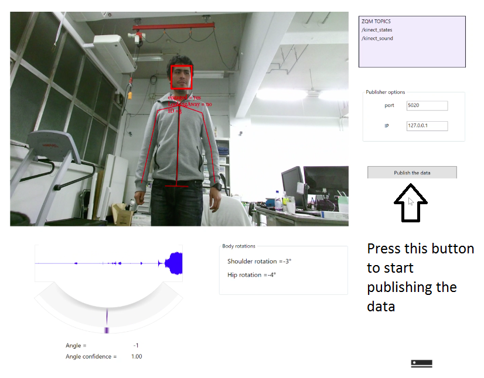

Kinect device (user guide)
===========
The next guide is user oriented. 

Installation of Kinect V2 (User guide)
**********************

1.- Download and install Kinect SDK V2 from <https://www.microsoft.com/en-us/download/details.aspx?id=44561>
2.- Download and install Visual Studio Community from <https://www.visualstudio.com/es/downloads/?utm_source=mscom&utm_campaign=msdocs>. For the actual version (2017), run the installer dowloaded 
and select ``Visual Studio Community 2017``, then select the ``.NET desktop development`` option and continue with the installation. 

Use the Kinect V2(User guide)
**********************

1. When the kinect V2 device is needed to be used press the button ``Use Kinect`` in the NEP Web interface before running a robot interaction (i.e. before pressing the ``Run interaction`` button). 

2.- This action will open the next interface

3. Before starting running an interaction it is also needed to press the button ``publish the data`` ony one timein this interface to start using the Kinect V2.

4.- Finally, press OK in the window dialog that appears after pressing the  ``publish the data`` button. Then, you can run your robot interaction form the NEP Web interface.

.. note:: If you press more than times the ``publish the data`` button the message ``Something happens, publisher already connected`` will appear. This means that the conection of the Kinect program with the another processing elements is already done.

Kinect device (Developer guide)
The kinect multimodal node obtain some set of descriptions of the human state from the vision and audio modalities of Kinect V2. A NetMQ socket (a C# wrapper of ZeroMQ) is used to publish this data. The published data can be readed from a ZeroMQ subscriber in another node. The next guide is developer oriented.

Instalation (Developer guide)
**********************

1.- Download and install Kinect SDK V2 from <https://www.microsoft.com/en-us/download/details.aspx?id=44561>
2.- Download and install Visual Studio Community from <https://www.visualstudio.com/es/downloads/?utm_source=mscom&utm_campaign=msdocs>. For the actual version (2017), run the installer dowloaded 
and select ``Visual Studio Community 2017``, then select the ``.NET desktop development`` option and continue with the installation. 

.. warning:: When installing other version of Visual Studio Community make sure of select C# and Nutget as tools to be installed. 

**NetMQ**
The code of the multimodal kinect node can be opened with Visual Studio running the ``FaceBasics-WPF.sln`` file which is in: ``modules/sensing/csharp/kinect/multimodal/FaceBasics-WPF.sln``. This C# project depends of the AsyncIO and NetMQ NuGet packages. If it is needed these packages can be downloaded using the Package Manager Console in the Menu of Visual Studio ``Tools/NuGet Package Manager/Package Manager Console``. Then, it is needed to write the next commands in the Package Manager Console:

``
Install-Package AsyncIO
Install-Package NetMQ -Version 3.3.3.4
``
.. warning:: The version 4 of NetMQ is not compatible, it will cause some compilation errors. To use the version 4 see the NetMQ documentation: <https://github.com/zeromq/netmq/wiki/Migrating-to-v4>

Run the multimodal kinect node and comunication with other nodes (Developer guide)
**********************

1. Open the ``FaceBasics-WPF.sln`` file which is in: ``modules/sensing/csharp/kinect/multimodal/FaceBasics-WPF.sln``. Run the Visual Studio Project using the button ``Start``. This will compile the project.

2. This action will also open the next interface:

.. note:: Another way to run this interface without compilation is to go to the folder ``launchers`` and run the ``kinect_multimodal_launcher.py`` (in windows with double click in the script, in Linux/OSX with the terminal). 

3. Press the button ``publish the data`` to start the comunication with a subscribed node. There are two different topics published by this node. In the one hand, the topic ``/kinect_states``, publish the face states, face orientation and joint body positions information of until 6 humans. On the other hand, ``/kinect_sound`` publish the results of the sound localization capabilities of kinect. 

4.- Finally, press OK in the window dialog that appears after pressing the  ``publish the data`` button.

.. note:: The intention of use the ``publish the data`` button instead of openning running the NetMQ publisher is foe debuging proposed, this step can be deleted in the future.

Example 1
**********************

The next example shows how receive the kinect information in a python script:

.. code-block:: python
    :linenos:

    # Import nep library
    from nep import*

    #Define the puslisher socket ip and port
    ip_kinect_sensing = "127.0.0.1"
    port_kinect_sensing = 5020

    #Define the topics to obatin the kinect data
    topic = '/kinect_states'
        
    # Start ZeroMQ comunication using the comunication.subscriber() class
    sub =  subscriber(ip_kinect_sensing, port_kinect_sensing, topic)

    # Run and read the kinect information until close the program
    while(True):
            success, states = sub.listen_human_state(True)
            if success == True:
                    print "face id " +  str(states['index']) +  ", orientation:" + str(states['face_yaw'])

**Description**

Using the NEP core API, it is possible to send and receive data between nodes writen in python or C#. In this case the kinect multimodal interface represent a sensory node which send the kinect information to the script presented before.
This script subscribes to the topic ``/kinect states``, which is published by the kinect multimodal node. In order to perform the comunication between these nodes the subcriber node must to know the ``ip`` and ``port`` of the publisher socket.

The line 12 of *Example 1* shows how a new subcriber instance called ``sub`` is created using the ``ip`` and ``port`` of the publisher and the ``topic`` to be subcribed. Then, in line 16 it is shown how the ``listen_human_state(block_mode)`` function it is used to obtain a python dictionary which contains the Kinect body and face states information. If this information is succefully readed then the face yaw orientation of all the faces detected is printed (the person detected are identified by the ``index`` parameter). 
 
.. note:: For more information of how to use python dictionaries see  `this link <https://docs.python.org/2/tutorial/datastructures.html#dictionaries>`_ 

The parameter ``block_mode`` is used to select the reading mode of the socket, which can be in blocking (True) or non blocking mode (False).

.. note:: A socket in **blocking mode** stop the execution (wait) until some data is readed in the socket.

.. note:: A socket in **non blocking mode** tnever wait util some data es readed. This is an important tool that can be used if you need to switch between many different connected sockets. 

Topics 
**********************

**Kinect States**

The information about the face of the recognized persons can be obtained from the ``/kinect_states`` topic using the next dictionary keys:

+------------------------+----------------------+--------+
| dictionaty key         |   values             |  type  |
|                        |                      |        |
+========================+======================+========+
|face_happy              | yes, no or unknown   | string |
+------------------------+----------------------+--------+
|face_engaged            | yes, no or unknown   | string |
+------------------------+----------------------+--------+
|face_glasses            | yes, no or unknown   | string |
+------------------------+----------------------+--------+
|face_lefteyeclosed      | yes, no or unknown   | string |
+------------------------+----------------------+--------+
|face_righteyeclosed     | yes, no or unknown   | string |
+------------------------+----------------------+--------+
|face_mouthopen          | yes, no or unknown   | string |
+------------------------+----------------------+--------+
|face_mouthmoved         | yes, no or unknown   | string |
+------------------------+----------------------+--------+
|face_lookingaway        | yes, no or unknown   | string |
+------------------------+----------------------+--------+
|face_yaw                | value in pixels      | float  |
+------------------------+----------------------+--------+
|face_pitch              | value in radians     | float  |
+------------------------+----------------------+--------+
|face_roll               | value in radians     | float  |
+------------------------+----------------------+--------+

The human body joints positions can be obtained using:

+------------------------+----------------------+--------------+
| dictionaty key         |   value in meters    |    type      |
|                        |                      |              |
+========================+======================+==============+
|ShoulderLeft            |          [x,y,z]     | list of float|
+------------------------+----------------------+--------------+
|ShoulderRight           |          [x,y,z]     | list of float|
+------------------------+----------------------+--------------+
|SpineBase               |          [x,y,z]     | list of float|
+------------------------+----------------------+--------------+
|SpineMid                |          [x,y,z]     | list of float|
+------------------------+----------------------+--------------+
|SpineShoulder           |          [x,y,z]     | list of float|
+------------------------+----------------------+--------------+
|WristLeft               |          [x,y,z]     | list of float|
+------------------------+----------------------+--------------+
|WristRight              |          [x,y,z]     | list of float|
+------------------------+----------------------+--------------+
|ElbowLeft               |          [x,y,z]     | list of float|
+------------------------+----------------------+--------------+
|ElbowRight              |          [x,y,z]     | list of float|
+------------------------+----------------------+--------------+
|HipLeft                 |          [x,y,z]     | list of float|
+------------------------+----------------------+--------------+
|HipRight                |          [x,y,z]     | list of float|
+------------------------+----------------------+--------------+
|Neck                    |          [x,y,z]     | list of float|
+------------------------+----------------------+--------------+
|Head                    |          [x,y,z]     | list of float|
+------------------------+----------------------+--------------+

Also it is posible to obtain the next body part orientations:

+------------------------+----------------------+--------+
| dictionaty key         |  value in radians    |  type  |
|                        |                      |        |
+========================+======================+========+
|shoulder_rot            |         angle        | float  |
+------------------------+----------------------+--------+
|hip_rot                 |         angle        | float  |
+------------------------+----------------------+--------+

Finally, the key ``ìndex`` is used to obtain the aformetionated infromation for each person recognized by Kinect.

**Audio**

Using the ``/kinect_audio`` it is posible to obtain the next information:

+------------------------+----------------------+--------+
| dictionaty key         |         value        |  type  |
|                        |                      |        |
+========================+======================+========+
|angle                   |   value in dregres   |  float |
+------------------------+----------------------+--------+
|conficence              |   value from 0 to 1  |  float |
+------------------------+----------------------+--------+

Example 2
**********************

The next example shows the information obtained from kinect V2 of some body and face parameters:

.. code-block:: python
    :linenos:

        # Import nep library
        from nep import*

        #Define the puslisher options
        ip_kinect_sensing = "127.0.0.1"
        port_kinect_sensing = 5020

        #Define the topics to obtain the kinect data
        topic = '/kinect_states'
        
        # Start ZeroMQ comunication using the comunication class
        sub =  subscriber(ip_kinect_sensing, port_kinect_sensing, topic)

        # This function is used to print the information of each parameter
        def print_info(dictionary, key):
                print 'parameter name: '  +  key  + ' ' + str(type(states[key])) +  ", value :" +  str(dictionary[key])

        # List of keys (parameters) to print
        keys = ['face_happy', 'face_engaged', 'face_yaw', 'face_roll', 'ShoulderLeft', 'shoulder_rot' ]

        # Print the name of the key, its type of data and its value
        while(True):
                success, states = sub.listen_human_state(False)
                if success == True:
                        for key in keys:
                                print_info(states, key)

TODO: Multithread example
**********************